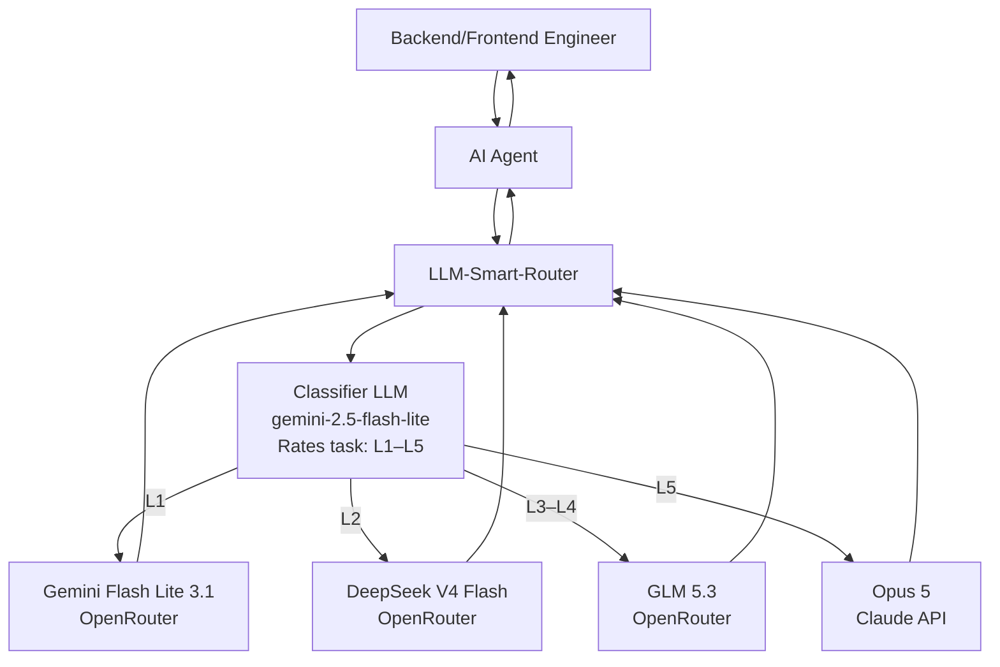

# LLM Smart Router

<p align="center">
  
</p>

A self-hosted Docker application that exposes an OpenAI-compatible API, classifies the **first prompt of each chat session** by task complexity (L1–L5), pins that session to the matching OpenRouter model, and routes every subsequent turn straight to the pinned model without re-classifying.

## Quick Start

```bash
cp .env.example .env   # fill in OPENROUTER_API_KEY and ROUTER_API_KEY
docker compose up -d --build
curl localhost:8080/healthz
```

Point any OpenAI-compatible client at `http://localhost:8080/v1`:

```python
from openai import OpenAI
client = OpenAI(base_url="http://localhost:8080/v1", api_key="your-router-key")
r = client.chat.completions.create(
    model="smart-router",
    messages=[{"role":"user","content":"Write a commit message for: fix typo"}],
    extra_headers={"X-Session-Id": "my-session-1"},
)
print(r.model)  # actual model used
```

## How It Works

- **Turn 1**: Classifier assigns L1–L5 → session pinned to the matching model
- **Turn 2+**: Straight to the pinned model, no classifier call (sub-ms lookup)
- **Escalation**: Free signals (repair language, tool errors, etc.) can ratchet the tier up mid-session
- **Config changes**: `session.on_config_change: keep_level` (default) re-resolves the tier's model per turn after settings changes — no pin expiry wait, no re-classification

## What's New in v2.0.0-beta

Three new request-path features, all hot-reloadable and enabled by default:

### 🔒 IP Redaction & Re-Hydration (`telemetry.privacy`)
Raw IP addresses in prompts are replaced with session-stable placeholders (`[ipaddress-01]`, …) before the request reaches the classifier or any upstream model, and re-hydrated back to the original IPs in the response. The classifier and tier models never see a real IP.
- Session-scoped SQLite mapping store (`/app/data/ip_redaction.db`, Docker volume `router-data`)
- Same IP → same placeholder across turns (context- and prefix-cache-friendly)
- Ports (`:8080`) and CIDR (`/24`) preserved; IPv4 + IPv6
- Streaming-safe: placeholders split across SSE chunks still re-hydrate (carry buffer)
- 24-hour retention with background purge job

### 🛡️ LLM Guardrails (`telemetry.guardrails`)
Two router-layer guardrails, independent of your agent's or the upstream API's own safety filters:
- **Input**: 24-rule prompt-injection/jailbreak catalog (8 categories: instruction override, jailbreak personas, system-prompt/secret exfiltration, tool abuse, sandbox evasion, social engineering, encoded payloads, multi-turn manipulation) with CRITICAL/HIGH/MEDIUM/LOW severities. Actions: `log` (default) | `block` (400 at/above severity threshold). Code-block-heavy messages skipped to avoid false positives.
- **Output**: 11 provider-prefixed credential patterns (OpenRouter, OpenAI, Anthropic, GitHub, AWS, Google, Slack, GitLab, Stripe, Telegram, PEM) masked with `***REDACTED***` before responses reach the caller.
- Run `python3 scripts/test_guardrails.py` for the router-level differential test (bypasses agent and upstream guardrails).

### ⚡ Upstream Prompt Caching (`provider.prompt_caching`)
Automatically makes the most of provider KV/prefix caches:
- `session_id` forwarded to OpenRouter for sticky routing (warm prefix cache)
- `cache_control` injection for Anthropic (`ttl: 5m|1h`) when the stable prefix exceeds `min_tokens` (default 1024)
- `cached_tokens` / cache-write telemetry surfaced in `/metrics` (`router_prompt_cached_tokens_total`, `router_prompt_cache_hit_ratio`)

## Configuration

Edit `config/settings.json` (hot-reloadable) to change:
- Tier → model mappings
- Classifier model and prompt
- Session TTL, escalation thresholds
- Heuristic rules

## Architecture




| Component | Technology |
|-----------|-----------|
| API | FastAPI + Uvicorn |
| HTTP Client | httpx (async, HTTP/2) |
| Validation | Pydantic v2 |
| Session Store | In-memory TTL+LRU / Redis |
| Metrics | prometheus-client |
| Logging | structlog (JSON) |
| Container | Multi-stage Docker, python:3.12-slim |

## Endpoints

- `POST /v1/chat/completions` — OpenAI-compatible chat
- `GET /v1/models` — List virtual router models
- `GET /healthz` / `GET /readyz` — Health checks
- `GET /metrics` — Prometheus metrics
- `GET /admin/stats` — Rolling counters
- `GET /admin/sessions` — Live session pins
- `GET /admin/settings` — Active config (incl. live guardrail mode)
- `POST /admin/settings/reload` — Hot-reload config

### Guardrail metrics
- `router_guardrail_findings_total{rule_id,severity,direction}` — injection/secret findings
- `router_guardrail_blocks_total{rule_id,severity}` — requests blocked in block mode
- `router_guardrail_secret_masks_total{rule_id}` — secrets masked in output
- `router_privacy_redactions_total` — requests passing through IP redaction
- `router_prompt_cached_tokens_total` / `router_prompt_cache_hit_ratio` — KV-cache usage

See the [full specification](./llm-smart-router-spec.md) for complete details.

## License

MIT
