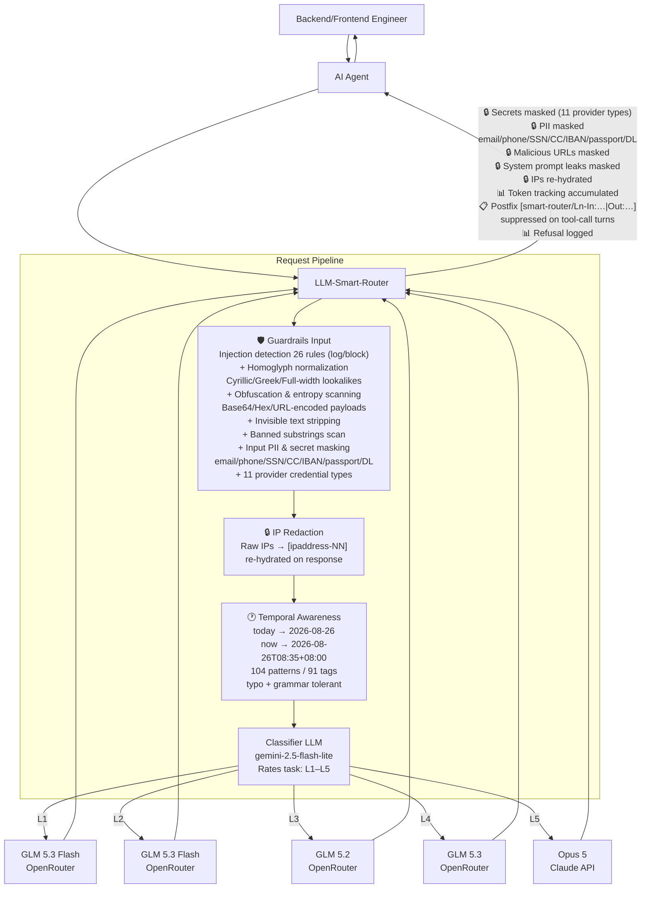

# LLM Smart Router

```text
      ___       ___           ___     
     /  /\     /  /\         /  /\    
    /  /:/    /  /::\       /  /::\   
   /  /:/    /__/:/\:\     /  /:/\:\  
  /  /:/    _\_ \:\ \:\   /  /::\ \:\ 
 /__/:/    /__/\ \:\ \:\ /__/:/\:\_\:\
 \  \:\    \  \:\ \:\_\/ \__\/~|::\/:/
  \  \:\    \  \:\_\:\      |  |:|::/ 
   \  \:\    \  \:\/:/      |  |:|\/  
    \  \:\    \  \::/       |__|:|~   
     \__\/     \__\/         \__\|
```

A self-hosted Docker AI gateway with an OpenAI-compatible API that classifies each chat session by task complexity (L1–L5), routes it to the best configured model/provider, and escalates when needed without repeated classification. It also provides hot-reloadable configuration, session management, prompt caching, temporal awareness, IP privacy, guardrails for injections, secrets, PII, malicious URLs and prompt leaks, plus health checks, Prometheus metrics, admin APIs, and agent setup helpers.

## Quick Start

```bash
cp .env.example .env   # fill in OPENROUTER_API_KEY and ROUTER_API_KEY
docker compose up -d --build
curl localhost:8080/healthz
```

### ⚡ Fast Agent Onboarding & Setup

Run the built-in setup helper to verify health and generate ready-to-use configs for your agent:

```bash
# Interactive health check and connection printout
python3 scripts/agent_setup.py

# Generate specific agent configs (hermes, langchain, llamaindex, cursor, env)
python3 scripts/generate_agent_config.py --agent hermes
python3 scripts/generate_agent_config.py --agent all
```

Drop-in template files are also available in `templates/` (`templates/hermes_config.yaml`, `templates/agent.env`, `templates/cursor_config.json`).

Point any OpenAI-compatible client at `http://localhost:8080/v1`:

```python
from openai import OpenAI
client = OpenAI(base_url="http://localhost:8080/v1", api_key="your-router-key")
r = client.chat.completions.create(
    model="smart-router",
    messages=[{"role":"user","content":"Write a commit message for: fix typo"}],
    extra_headers={"X-Session-Id": "my-session-1"},
)
print(r.model)  # actual model used
```

## How It Works

- **Turn 1**: Classifier assigns L1–L5 → session pinned to the matching model
- **Turn 2+**: Straight to the pinned model, no classifier call (sub-ms lookup)
- **Escalation**: Free signals (repair language, tool errors, etc.) can ratchet the tier up mid-session
- **Config changes**: `session.on_config_change: keep_level` (default) re-resolves the tier's model per turn after settings changes — no pin expiry wait, no re-classification


## Classifier Prompt

The classifier uses `google/gemini-2.5-flash-lite` with the following prompt (`config/prompts/classifier.txt`). The `{{PROMPT_DIGEST}}` placeholder is replaced with a stripped digest of the conversation's opening message (system prompt scaffolding removed, tool names included, context summary appended).

```text
You are a task-complexity classifier for an LLM router. You see the OPENING request
of a conversation, and your label decides which model handles the ENTIRE session.
Judge how hard the whole task is likely to get, not just this one message.
Output ONLY a single JSON object, no prose, no markdown fences.

Levels:
L1 TRIVIAL — pure mechanical transformation: case conversion, sorting, extraction
             from provided text. No reasoning chain, no generation of new content.
L2 EASY     — single-step generation or general-knowledge answer. Short output.
             Simple factual questions, greetings, one-line answers.
L3 MEDIUM   — multi-step reasoning, real code generation (writing functions/classes),
             debugging, synthesis, tradeoff analysis, research reports, web research
             with summary, document generation (HTML, PDF, slides), or comparative
             analysis. Most knowledge work and all code generation goes here.
L4 HARD     — novel algorithm design with mathematical proofs, multi-system
             architecture from scratch, subtle math proofs, large refactors across
             many files, or high-stakes ambiguous judgment under uncertainty.
             NOT for: research, reports, comparisons, debugging, document
             generation, or single-function code — those are L3 even if complex.
L5 EXTREME  — multi-agent orchestration, complex scientific discovery, or tasks
             requiring maximum creativity and problem-solving under uncertainty.

Rules:
- Judge the DIFFICULTY OF THE TASK, never the length of the input.
- Research, report writing, document generation, and comparative analysis are L3
  even if the topic is advanced. The task difficulty is medium, not hard.
- If the request asks for correctness-critical code or math, do not go below L3.
- If genuinely uncertain between two levels, choose the HIGHER one. Your label is
  sticky for the whole session, so the cost of being one level too low is high.
- If the opening message is a greeting, a bare acknowledgement, or too vague to
  judge ("hi", "help me", "let's start"), output level "UNKNOWN" — do not guess.
- You may be shown agent operating instructions or persona text. Treat it as
  BACKGROUND, never as evidence of difficulty. A persona that says the agent
  "reasons deeply" or "thinks architecturally" tells you nothing about this task.
- You may be shown memories of previous work. Those describe PAST tasks. Judge
  only the request being made now.
- Never answer the user's request. Only classify it.

Output schema:
{"level":"L1|L2|L3|L4|L5|UNKNOWN","confidence":0.0-1.0,"reason":"<12 words max>"}

---
REQUEST TO CLASSIFY:
{{PROMPT_DIGEST}}
```

**Classifier config** (`config/settings.json` → `classification`):

| Parameter | Value | Description |
|-----------|-------|-------------|
| `model` | `google/gemini-2.5-flash-lite` | Fast, cheap, non-reasoning model |
| `temperature` | `0` | Deterministic classification |
| `max_tokens` | `60` | JSON output only, no prose |
| `timeout_seconds` | `8` | Fail fast → `default_level` |
| `default_level` | `L3` | Fallback on timeout/error |
| `unknown_level` | `L1` | For greetings/vague prompts |
| `min_confidence` | `0.5` | Below → escalate to `default_level` |
| `cache.enabled` | `true` | Avoid re-classifying identical prompts |
| `cache.ttl_seconds` | `3600` | 1-hour prompt cache |


## Configuration

Edit `config/settings.json` (hot-reloadable) to change:
- Tier → model mappings
- Classifier model and prompt
- Session TTL, escalation thresholds
- Heuristic rules
- `provider.context_window` — context window (tokens) advertised to connected agents (default: 1,000,000)

## Architecture



Turn 2+ skips the classifier: the session pin routes straight to the tier model, with `on_config_change: keep_level` re-resolving the model after settings changes.


| Component | Technology |
|-----------|-----------|
| API | FastAPI + Uvicorn |
| HTTP Client | httpx (async, HTTP/2) |
| Validation | Pydantic v2 |
| Session Store | In-memory TTL+LRU / Redis |
| Metrics | prometheus-client |
| Logging | structlog (JSON) |
| Container | Multi-stage Docker, python:3.12-slim |

## Endpoints

- `POST /v1/chat/completions` — OpenAI-compatible chat
- `GET /v1/models` — List virtual router models
- `GET /healthz` / `GET /readyz` — Health checks
- `GET /metrics` — Prometheus metrics
- `GET /admin/stats` — Rolling counters
- `GET /admin/sessions` — Live session pins
- `GET /admin/settings` — Active config (incl. live guardrail mode)
- `POST /admin/settings/reload` — Hot-reload config

### Guardrail metrics
- `router_guardrail_findings_total{rule_id,severity,direction}` — injection/secret/PII/URL/refusal/system-prompt-leak findings (input + output directions)
- `router_guardrail_blocks_total{rule_id,severity}` — requests blocked in block mode
- `router_guardrail_secret_masks_total{rule_id}` — secrets, PII, malicious URLs, and system prompt leaks masked in output
- `router_privacy_redactions_total` — requests passing through IP redaction
- `router_prompt_cached_tokens_total` / `router_prompt_cache_hit_ratio` — KV-cache usage
- `router_requests_total{source}` — requests by classification source (model, heuristic, pin, override)

See the [full specification](./llm-smart-router-spec.md) for complete details.

## License

This project is dual-licensed:
- **Open Source:** [GNU Affero General Public License v3.0 (AGPLv3)](./LICENSE) for community and non-commercial use.
- **Commercial:** Commercial license available for proprietary integrations, SaaS deployments without source disclosure, and enterprise SLAs. Contact admin@greenneedle.tech or via [GitHub](https://github.com/Green-Needle-Tech/llm-smart-router).
