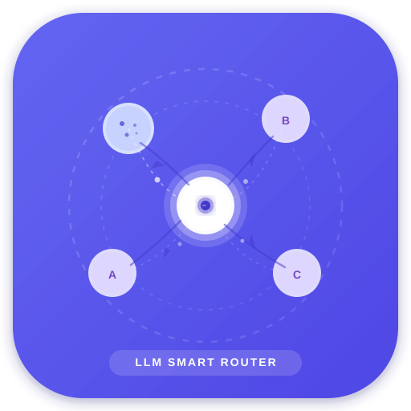
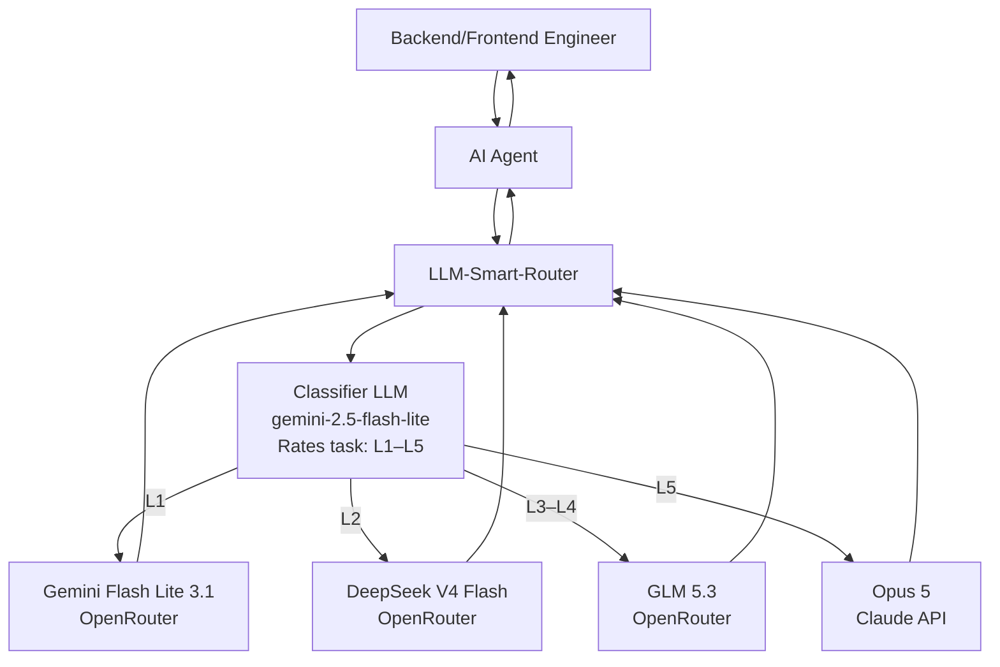

# LLM Smart Router

<p align="center">
  
</p>

A self-hosted Docker application that exposes an OpenAI-compatible API, classifies the **first prompt of each chat session** by task complexity (L1–L5), pins that session to the matching OpenRouter model, and routes every subsequent turn straight to the pinned model without re-classifying.

## Quick Start

```bash
cp .env.example .env   # fill in OPENROUTER_API_KEY and ROUTER_API_KEY
docker compose up -d --build
curl localhost:8080/healthz
```

Point any OpenAI-compatible client at `http://localhost:8080/v1`:

```python
from openai import OpenAI
client = OpenAI(base_url="http://localhost:8080/v1", api_key="your-router-key")
r = client.chat.completions.create(
    model="smart-router",
    messages=[{"role":"user","content":"Write a commit message for: fix typo"}],
    extra_headers={"X-Session-Id": "my-session-1"},
)
print(r.model)  # actual model used
```

## How It Works

- **Turn 1**: Classifier assigns L1–L5 → session pinned to the matching model
- **Turn 2+**: Straight to the pinned model, no classifier call (sub-ms lookup)
- **Escalation**: Free signals (repair language, tool errors, etc.) can ratchet the tier up mid-session

## Configuration

Edit `config/settings.json` (hot-reloadable) to change:
- Tier → model mappings
- Classifier model and prompt
- Session TTL, escalation thresholds
- Heuristic rules

## Architecture




| Component | Technology |
|-----------|-----------|
| API | FastAPI + Uvicorn |
| HTTP Client | httpx (async, HTTP/2) |
| Validation | Pydantic v2 |
| Session Store | In-memory TTL+LRU / Redis |
| Metrics | prometheus-client |
| Logging | structlog (JSON) |
| Container | Multi-stage Docker, python:3.12-slim |

## Endpoints

- `POST /v1/chat/completions` — OpenAI-compatible chat
- `GET /v1/models` — List virtual router models
- `GET /healthz` / `GET /readyz` — Health checks
- `GET /metrics` — Prometheus metrics
- `GET /admin/stats` — Rolling counters
- `GET /admin/sessions` — Live session pins
- `POST /admin/settings/reload` — Hot-reload config

See the [full specification](./llm-smart-router-spec.md) for complete details.

## License

MIT
