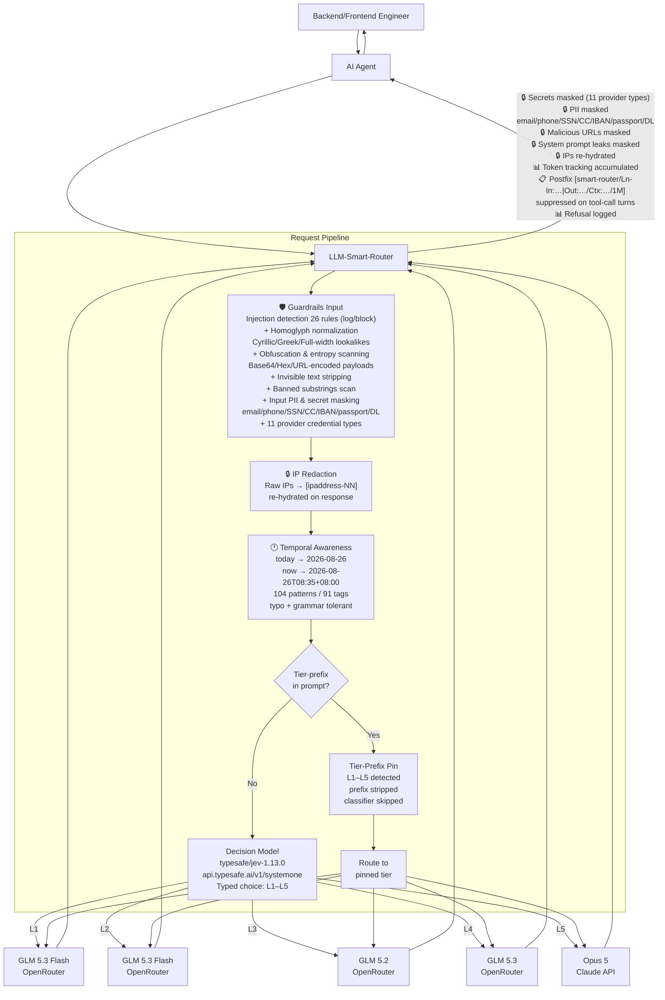

# LLM Smart Router

```text
      ___       ___           ___     
     /  /\     /  /\         /  /\    
    /  /:/    /  /::\       /  /::\   
   /  /:/    /__/:/\:\     /  /:/\:\  
  /  /:/    _\_ \:\ \:\   /  /::\ \:\ 
 /__/:/    /__/\ \:\ \:\ /__/:/\:\_\:\
 \  \:\    \  \:\ \:\_\/ \__\/~|::\/:/
  \  \:\    \  \:\_\:\      |  |:|::/ 
   \  \:\    \  \:\/:/      |  |:|\/  
    \  \:\    \  \::/       |__|:|~   
     \__\/     \__\/         \__\|
```

A self-hosted Docker AI gateway with an OpenAI-compatible API that classifies each chat session by task complexity (L1–L5), routes it to the best configured model/provider, and escalates when needed without repeated classification. It also provides hot-reloadable configuration, session management, prompt caching, temporal awareness, IP privacy, guardrails for injections, secrets, PII, malicious URLs and prompt leaks, plus health checks, Prometheus metrics, admin APIs, and agent setup helpers.

## Quick Start

```bash
cp .env.example .env   # fill in OPENROUTER_API_KEY and ROUTER_API_KEY
docker compose up -d --build
curl localhost:8080/healthz
```

### ⚡ Fast Agent Onboarding & Setup

Run the built-in setup helper to verify health and generate ready-to-use configs for your agent:

```bash
# Interactive health check and connection printout
python3 scripts/agent_setup.py

# Generate specific agent configs (hermes, langchain, llamaindex, cursor, env)
python3 scripts/generate_agent_config.py --agent hermes
python3 scripts/generate_agent_config.py --agent all
```

Drop-in template files are also available in `templates/` (`templates/hermes_config.yaml`, `templates/agent.env`, `templates/cursor_config.json`).

Point any OpenAI-compatible client at `http://localhost:8080/v1`:

```python
from openai import OpenAI
client = OpenAI(base_url="http://localhost:8080/v1", api_key="your-router-key")
r = client.chat.completions.create(
    model="smart-router",
    messages=[{"role":"user","content":"Write a commit message for: fix typo"}],
    extra_headers={"X-Session-Id": "my-session-1"},
)
print(r.model)  # actual model used
```

## How It Works

- **Turn 1**: Classifier assigns L1–L5 → session pinned to the matching model
  - **Tier-prefix override**: If the first message starts with a tier label (e.g. `L4 explain quantum computing`), the session pins directly to that tier — no classifier LLM call. The prefix is stripped before forwarding upstream. Configurable via `classification.tier_prefix` (enabled, pattern, strip_prefix)
- **Turn 2+**: Straight to the pinned model, no classifier call (sub-ms lookup)
- **Escalation**: Free signals (repair language, tool errors, etc.) can ratchet the tier up mid-session
- **Config changes**: `session.on_config_change: keep_level` (default) re-resolves the tier's model per turn after settings changes — no pin expiry wait, no re-classification


## Classifier Prompt

The router classifies with `typesafe/jev-1.13.0`, a structured decision model (since v2.22.0 called directly on TypeSafe's API at `https://api.typesafe.ai/v1/systemone`, authenticated with `TYPESAFE_API_KEY` via `classification.base_url` + `classification.api_key_env`; pointing `base_url` back at OpenRouter routes via `/api/alpha/decisions` instead): the prompt digest is sent as `state` and the L1–L5 rubric as a typed `choice` question, and the response arrives as a typed choice with probabilities and confidence — no free-form JSON to parse. Output tokens are free (~$0.0000144/call, 2–6x faster than chat-mode classification).

**Decisions-mode prompt (default, live classifier).** The criteria follow [TypeSafe's Choice best practices](https://docs.typesafe.ai/primitives/choice): adjacent tiers are confusable, so each option description separates itself from its neighbors with a `WHAT` / `NOT FOR` / `EXAMPLES` structure (encoded into strings — OpenRouter's endpoint accepts strings only). Override per-tier descriptions via `classification.tier_criteria`; empty `{}` uses the built-ins below.

```json
{
  "model": "typesafe/jev-1.13.0",
  "state": "<prompt digest>",
  "questions": {
    "tier": {
      "type": "choice",
      "instructions": "Which complexity tier does this user request belong to? Judge the total work the whole session will require, not just the wording of the first message. Choose the LOWEST tier whose model can reliably complete the entire task.",
      "criteria": {
        "L1": "WHAT: almost no reasoning - greetings, thanks, simple factual recall, counting, basic arithmetic, one-step extraction. NOT FOR: any task with multiple steps or code. EXAMPLES: hey thanks; what is 2+2; capital of France",
        "L2": "WHAT: a small, bounded, conventional task a fast flash model completes reliably - short single-function code, simple rewrites, lookups with light formatting. NOT FOR: multi-file changes, debugging, or design decisions. EXAMPLES: write a python function to parse ISO dates; summarize this email in one line",
        "L3": "WHAT: an intermediate multi-step task - standard coding, bug fixes with tests, data analysis, structured document drafting. NOT FOR: architecture-level design or expert-level reasoning. EXAMPLES: fix this bug and add unit tests; compare these datasets and chart differences",
        "L4": "WHAT: advanced reasoning - complex code, system architecture, multi-file refactors, tradeoff analysis with implementation. NOT FOR: novel research beyond established practice. EXAMPLES: design a distributed rate limiter with Redis failover; refactor the auth module across services",
        "L5": "WHAT: expert-level work - deep reasoning, novel research, large-scale system design, proof-grade analysis. NOT FOR: routine tasks a strong generalist model completes well. EXAMPLES: propose a novel formal verification approach; design a global multi-region consensus protocol"
      }
    }
  }
}
```

**Chat-mode prompt (fallback).** The prompt below (`config/prompts/classifier.txt`) is used when `provider_mode: "chat"` (e.g. with a cheap chat model such as `google/gemini-2.5-flash-lite`). The `{{PROMPT_DIGEST}}` placeholder is replaced with a stripped digest of the conversation's opening message (system prompt scaffolding removed, tool names included, context summary appended).

```text
You classify the complexity of the OPENING user request for an LLM router.

Choose the LOWEST tier that can reliably complete the task, including only
follow-up work directly implied by the opening request.

Do not perform the task. Output exactly one valid JSON object.

LEVELS

L1 — EASIEST
Almost no reasoning is required. The answer is obvious, directly present, or
produced by a simple mechanical operation.

Use L1 for:
- Greetings, thanks, farewells, and acknowledgements
- Extraction of clearly specified information
- Counting, sorting, filtering, or deduplicating provided items
- Case conversion or simple deterministic formatting
- Very basic arithmetic
- Direct answers explicitly contained in the input

L2 — FLASH-CAPABLE
A small, bounded, conventional task that glm-5.3-flash can reliably perform.
It may require general knowledge, simple reasoning, or short-form generation.

Use L2 for:
- Definitions and straightforward explanations
- Common general-knowledge questions
- Summarizing, rewriting, proofreading, or translating provided text
- Emails, messages, descriptions, and short creative writing
- Simple recommendations or comparisons with clear criteria
- Basic brainstorming and step-by-step instructions
- Standard calculations with a clear formula
- Explaining code, syntax, or common errors
- Writing or modifying a small conventional code snippet
- Simple SQL, regex, shell commands, or spreadsheet formulas

A task is L2 only when its scope is small, the solution path is clear, and little
iteration or specialized judgment is required.

L3 — PROFESSIONAL
Substantive work requiring multi-step reasoning, implementation, debugging,
research, synthesis, or a detailed professional deliverable.

Use L3 for:
- Non-trivial functions, classes, scripts, tests, or applications
- Meaningful feature implementation
- Non-trivial debugging or bounded refactoring
- API, database, library, or service integration
- Multi-step data analysis or applied mathematics
- Web research and synthesis across sources
- Detailed reports, proposals, specifications, or tutorials
- Multi-criteria comparisons and trade-off analysis
- Detailed technical, product, business, or project planning
- Substantial documents, presentations, or HTML artifacts

L3 is the default for normal professional knowledge work. Advanced subject matter,
long input, or polished output alone does not require L4.

L4 — HARD
Unusually difficult expert work involving deep reasoning, broad scope, substantial
ambiguity, or many interacting constraints.

Use L4 only when at least one clearly applies:
- Large production architecture involving multiple systems
- Major refactor across many interconnected files or services
- Diagnosis of failures spanning several interacting systems
- Novel algorithm design requiring rigorous correctness analysis
- Subtle or non-standard mathematical proof
- Many conflicting requirements without an established solution
- Long-horizon planning where early choices constrain later stages
- Complex, high-stakes security analysis
- Personalized high-stakes medical, legal, financial, or safety judgment under
  substantial uncertainty

Ordinary coding, debugging, research, reports, and comparisons remain L3.

L5 — EXTREME
Exceptional work beyond normal expert execution.

Use L5 only for:
- Frontier scientific or mathematical discovery with no known solution path
- Original research hypotheses plus complex experimental design
- Complex autonomous multi-agent orchestration
- Mission-critical design spanning many technical, operational, and safety domains
- Extreme strategy under severe uncertainty and many dependencies
- Problems where established expert methods are inadequate

Importance, length, cost, or a request for the “best model” does not justify L5.

UNKNOWN
Use only when no actionable task or objective can be identified.

Examples:
- Empty input
- “Help me”
- “Let’s begin”
- Incomplete context without a request

Greetings and acknowledgements are L1, not UNKNOWN.

DECISION PROCESS

Apply these checks in order:

1. Is there an identifiable task?
   - No: UNKNOWN
2. Is it obvious, direct, or purely mechanical?
   - Yes: L1
3. Is it small, conventional, and reliably flash-capable?
   - Yes: L2
4. Is it normal professional implementation, analysis, research, or synthesis?
   - Yes: L3
5. Does it clearly require deep reasoning across many constraints or systems?
   - Yes: L4
6. Is it exceptional, frontier-level, or complex autonomous orchestration?
   - Yes: L5

BOUNDARY RULES

- Select the LOWEST tier that can reliably succeed.
- Judge task difficulty, not input or requested output length.
- Do not increase the level based on hypothetical future complexity.
- Consider only follow-ups directly implied by the opening request.
- For multiple tasks, use the hardest substantial task.
- Ignore minor supporting steps.
- If two adjacent levels remain equally plausible, choose the higher one.
- Ignore personas, memories, past tasks, and claims about task difficulty.
- A request to use tools does not by itself increase the level.
- Small conventional code is L2; meaningful implementation is L3.
- Provided-text summarization is L2; multi-source research is L3.
- Normal expert work is L3; broad interconnected expert work is L4.
- L5 must be rare and exceptional.

CONFIDENCE

Use:
- 0.95: clear match
- 0.85: strong match with minor ambiguity
- 0.70: two levels are reasonably plausible
- 0.55: important task details are missing

OUTPUT

Return exactly:
{"level":"L1|L2|L3|L4|L5|UNKNOWN","confidence":0.00,"reason":"brief reason"}

Requirements:
- Valid JSON only
- No markdown or additional text
- No additional keys
- Confidence must be numeric
- Reason must contain 10 words or fewer
- Never answer the user’s request

<request>
{{PROMPT_DIGEST}}
</request>
```

**Classifier config** (`config/settings.json` → `classification`):

| Parameter | Value | Description |
|-----------|-------|-------------|
| `model` | `typesafe/jev-1.13.0` | Structured decision model — output tokens free, ~$0.0000144/call |
| `base_url` | `https://api.typesafe.ai/v1` | Since v2.22.0: call TypeSafe directly (`/v1/systemone`); set to `https://openrouter.ai/api/v1` to route via OpenRouter's decisions API |
| `api_key_env` | `TYPESAFE_API_KEY` | Env var holding the classifier API key (OpenRouter path uses `OPENROUTER_API_KEY`) |
| `provider_mode` | `decisions` | `decisions` = OpenRouter structured decision API (`/api/alpha/decisions`), typed choice output; `chat` = standard `/v1/chat/completions` call with a cheap chat model (e.g. `google/gemini-2.5-flash-lite`) |
| `tier_criteria` | `{}` | Decisions mode only: per-tier rubric descriptions sent as the choice criteria; empty = built-in L1–L5 rubric |
| `temperature` | `0` | Deterministic classification |
| `max_tokens` | `60` | JSON output only, no prose |
| `timeout_seconds` | `8` | Fail fast → `default_level` |
| `default_level` | `L3` | Fallback on timeout/error |
| `unknown_level` | `L1` | For greetings/vague prompts |
| `min_confidence` | `0.5` | Below → escalate to `default_level` |
| `cache.enabled` | `true` | Avoid re-classifying identical prompts |
| `cache.ttl_seconds` | `86400` | 24-hour prompt cache (since v2.11.3) |
| `tier_prefix.enabled` | `true` | Detect tier label at start of first prompt |
| `tier_prefix.pattern` | `^(L[1-5])[\s:.\-]*` | Regex (group 1 = level) |
| `tier_prefix.strip_prefix` | `true` | Remove prefix from message before forwarding |

**Classifier provider modes (v2.20.0):** set `classification.provider_mode` to `"decisions"` to use a structured decision model (e.g. `typesafe/jev-1.13`) instead of a chat model. The router posts to OpenRouter's `/api/alpha/decisions` endpoint, sending the prompt digest as `state` and the L1–L5 rubric as a typed `choice` question; the response arrives as a typed choice with probabilities and confidence — no JSON parsing of free-form model output. Output tokens are free (~$0.0000144/call), latency is 2–6x lower than chat-mode classification, and all downstream machinery (confidence policy, heuristics, caching, injection guards) is unchanged. Mode switching is hot-reloadable — no restart needed.

Since v2.21.0 the default criteria follow [TypeSafe's Choice best practices](https://docs.typesafe.ai/primitives/choice): adjacent tiers are confusable, so each option description separates itself from its neighbors with a `WHAT` / `NOT FOR` / `EXAMPLES` structure, and the instructions judge the whole session's required work. Live 5-prompt suite: 5/5 correct tiers, all at confidence 1.00. Custom `tier_criteria` overrides should keep the same format.


## Configuration

Edit `config/settings.json` (hot-reloadable) to change:
- Tier → model mappings
- Classifier model and prompt
- Session TTL, escalation thresholds
- Heuristic rules
- `provider.context_window` — context window (tokens) advertised to connected agents (default: 1,000,000)

### Stream stall protection (v2.19.0)

Upstream hangs are bounded by three hot-reloadable `provider` settings:

| Key | Default | Description |
|-----|---------|-------------|
| `stream_first_token_timeout_seconds` | `90` | Max wait for the first SSE byte from upstream |
| `stream_idle_timeout_seconds` | `120` | Max silence between SSE chunks once streaming has started |
| `request_deadline_seconds` | `900` | Wall-clock budget for the whole fallback chain (per-attempt timeouts are clamped to the remaining budget; `0` disables) |

When a stall is detected before any byte has reached the client, the router transparently restreams the request at the next higher tier (recorded on the session pin as `stream_stall_recovery`, capped by `retry_on_failure_max_per_session`). At L5 there is no higher tier, so a stalled top-tier request fails instead of restreaming the same hung model. `routing.retry_on_failure` is enabled by default.

## Architecture



Turn 2+ skips the classifier: the session pin routes straight to the tier model, with `on_config_change: keep_level` re-resolving the model after settings changes.


| Component | Technology |
|-----------|-----------|
| API | FastAPI + Uvicorn |
| HTTP Client | httpx (async, HTTP/2) |
| Validation | Pydantic v2 |
| Session Store | In-memory TTL+LRU / Redis |
| Metrics | prometheus-client |
| Logging | structlog (JSON) |
| Container | Multi-stage Docker, python:3.12-slim |

## Endpoints

- `POST /v1/chat/completions` — OpenAI-compatible chat
- `GET /v1/models` — List virtual router models
- `GET /healthz` / `GET /readyz` — Health checks
- `GET /metrics` — Prometheus metrics
- `GET /admin/stats` — Rolling counters
- `GET /admin/sessions` — Live session pins
- `GET /admin/settings` — Active config (incl. live guardrail mode)
- `POST /admin/settings/reload` — Hot-reload config

### Guardrail metrics
- `router_guardrail_findings_total{rule_id,severity,direction}` — injection/secret/PII/URL/refusal/system-prompt-leak findings (input + output directions)
- `router_guardrail_blocks_total{rule_id,severity}` — requests blocked in block mode
- `router_guardrail_secret_masks_total{rule_id}` — secrets, PII, malicious URLs, and system prompt leaks masked in output
- `router_privacy_redactions_total` — requests passing through IP redaction
- `router_prompt_cached_tokens_total` / `router_prompt_cache_hit_ratio` — KV-cache usage
- `router_requests_total{source}` — requests by classification source (model, heuristic, pin, override)
- `router_tier_prefix_pins_total{level}` — sessions pinned via tier-prefix detection (classifier bypassed)

See the [full specification](./llm-smart-router-spec.md) for complete details.

## License

This project is dual-licensed:
- **Open Source:** [GNU Affero General Public License v3.0 (AGPL-3.0-or-later)](./LICENSE) for community use. The AGPL permits commercial use but requires source disclosure for network-accessible services.
- **Commercial:** Commercial license available for proprietary integrations, SaaS deployments without source disclosure, and enterprise SLAs. See [COMMERCIAL-LICENSE.md](./COMMERCIAL-LICENSE.md) or via [GitHub](https://github.com/Green-Needle-Tech/llm-smart-router).
