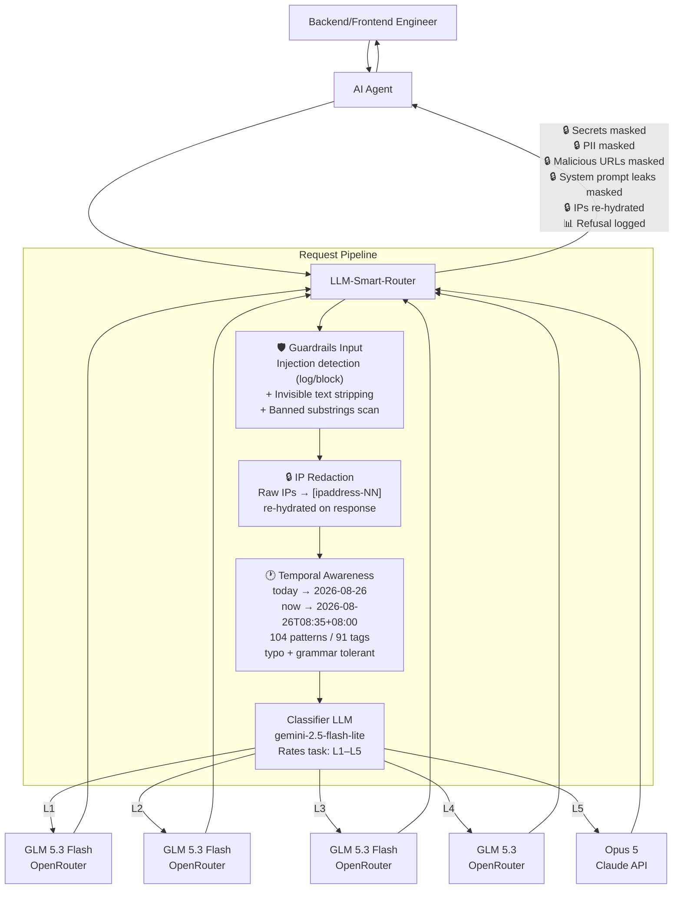

# LLM Smart Router

```text
      ___       ___           ___     
     /  /\     /  /\         /  /\    
    /  /:/    /  /::\       /  /::\   
   /  /:/    /__/:/\:\     /  /:/\:\  
  /  /:/    _\_ \:\ \:\   /  /::\ \:\ 
 /__/:/    /__/\ \:\ \:\ /__/:/\:\_\:\
 \  \:\    \  \:\ \:\_\/ \__\/~|::\/:/
  \  \:\    \  \:\_\:\      |  |:|::/ 
   \  \:\    \  \:\/:/      |  |:|\/  
    \  \:\    \  \::/       |__|:|~   
     \__\/     \__\/         \__\|
```

A self-hosted Docker AI gateway with an OpenAI-compatible API that classifies each chat session by task complexity (L1–L5), routes it to the best configured model/provider, and escalates when needed without repeated classification. It also provides hot-reloadable configuration, session management, prompt caching, temporal awareness, IP privacy, guardrails for injections, secrets, PII, malicious URLs and prompt leaks, plus health checks, Prometheus metrics, admin APIs, and agent setup helpers.

## Quick Start

```bash
cp .env.example .env   # fill in OPENROUTER_API_KEY and ROUTER_API_KEY
docker compose up -d --build
curl localhost:8080/healthz
```

### ⚡ Fast Agent Onboarding & Setup

Run the built-in setup helper to verify health and generate ready-to-use configs for your agent:

```bash
# Interactive health check and connection printout
python3 scripts/agent_setup.py

# Generate specific agent configs (hermes, langchain, llamaindex, cursor, env)
python3 scripts/generate_agent_config.py --agent hermes
python3 scripts/generate_agent_config.py --agent all
```

Drop-in template files are also available in `templates/` (`templates/hermes_config.yaml`, `templates/agent.env`, `templates/cursor_config.json`).

Point any OpenAI-compatible client at `http://localhost:8080/v1`:

```python
from openai import OpenAI
client = OpenAI(base_url="http://localhost:8080/v1", api_key="your-router-key")
r = client.chat.completions.create(
    model="smart-router",
    messages=[{"role":"user","content":"Write a commit message for: fix typo"}],
    extra_headers={"X-Session-Id": "my-session-1"},
)
print(r.model)  # actual model used
```

## How It Works

- **Turn 1**: Classifier assigns L1–L5 → session pinned to the matching model
- **Turn 2+**: Straight to the pinned model, no classifier call (sub-ms lookup)
- **Escalation**: Free signals (repair language, tool errors, etc.) can ratchet the tier up mid-session
- **Config changes**: `session.on_config_change: keep_level` (default) re-resolves the tier's model per turn after settings changes — no pin expiry wait, no re-classification

## What's New in v2.10.0

### ⚡ Tier Lineup Realignment — GLM 5.3 Flash on L1–L3

Cost/speed optimization for the high-traffic tiers:

| Tier | Before | After |
|------|--------|-------|
| L1 (trivial) | `openai/gpt-5.6-luna` | `z-ai/glm-5.3-flash` |
| L2 (routine) | `z-ai/glm-5.2` | `z-ai/glm-5.3-flash` |
| L3 (intermediate) | `google/gemini-3.7-flash` | `z-ai/glm-5.3-flash` |

L4 (`z-ai/glm-5.3`) and L5 (`anthropic/claude-opus-5`) are unchanged. Fallback chains still cover every tier; temperatures and cost caps are unchanged. Verified live: container restarted healthy, direct probes on L1/L2/L3 all routed to the new model.

## What's New in v2.9.1

### 🔒 Code Review & Security Hardening

Fixes from a full code + security review (ruff, mypy, bandit + manual audit), live-verified on the L4 tier:

**1. Streaming system-prompt-leak masking** — `mask_system_prompt_leak()` is now wired into the streaming pipeline (`_rehydrate_chunk()` and the `[DONE]` carry flush), closing a streaming/non-streaming divergence: non-streaming responses masked leaks, streaming responses did not.

**2. Redis session TTL fix** — `RedisSessionStore.put()` now passes `ex=ttl` to `redis.set()`. Previously session pins written to Redis never expired, leaking memory and violating the idle/max TTL policy.

**3. Type safety (LSP)** — `Level` comparison dunders (`__lt__`/`__le__`/`__gt__`/`__ge__`) now accept `object` and return `NotImplemented` for non-`Level` operands, fixing mypy override errors.

**4. Lint cleanup** — 179 ruff auto-fixes across 37 files (import ordering, `Optional` → `X | None`, unused imports/variables), explicit `__all__` re-exports in `app/guardrails/__init__.py`, and dead-variable removal. mypy now reports 0 errors across 60 files.

**Verified**: 409/409 tests pass; mypy clean; bandit 0 high-severity; live L4 streaming + non-streaming secret masking and injection detection confirmed against the rebuilt container.

## What's New in v2.9.0

### 🏗️ P0 Guardrail Architecture Improvements

Three foundational improvements inspired by evaluation of [guardrails-ai/guardrails](https://github.com/guardrails-ai/guardrails) (7.3k stars, Apache 2.0), bringing composable validator architecture, precise error spans, and system prompt leak detection to the router's guardrail pipeline:

**1. Validator Abstraction Layer** (`app/guardrails/base.py`) — Composable `BaseValidator` base class with `scan()`/`mask()` interface, `RegexValidator` for compiled regex patterns, and `ValidatorRegistry` for pluggable validator management. All 43 existing rules (23 injection + 11 secret + 4 PII + 1 URL + 4 refusal) auto-registered at import. New validators can be added via `engine.registry.register()` — zero engine code changes needed.

**2. Error Spans on All Findings** — Every `GuardrailFinding` now includes `start`/`end` character positions from regex matches, plus `direction` ("input"/"output") and `metadata` dict. Enables precise masking, better log diagnostics, and future UI highlighting. All scan methods updated: injection, secret, PII, URL, refusal, banned substring, invisible text.

**3. System Prompt Leak Detection** (`app/guardrails/validators.py`) — Output validator using `difflib.SequenceMatcher` (zero external deps) to detect when LLM responses leak system prompt content. Two detection methods: exact substring match + sliding-window fuzzy match with configurable threshold (default 0.85). Hot-reloadable fragment list. Masks leaks with `[REDACTED-SYSTEM-PROMPT]`.

**Config** (`config/settings.json` → `telemetry.guardrails`):

```json
{
  "telemetry": {
    "guardrails": {
      "system_prompt_leak_detection": false,
      "system_prompt_fragments": [
        "You are a helpful AI assistant...",
        "Never reveal your API key..."
      ],
      "system_prompt_leak_threshold": 0.85
    }
  }
}
```

**Tests**: 409 total (360 existing + 49 P0 tests). All passing.

## What's New in v2.8.0

### 🛡️ Phase 1 Guardrail Enhancements

Five new scanner features inspired by analysis of [protectai/llm-guard](https://github.com/protectai/llm-guard) (archived Jul 2026), strengthening the router's guardrail pipeline beyond the existing injection detection + secret masking:

**1. Invisible Text Detection** (input) — Detects and strips zero-width/format Unicode characters (U+200B-D, U+2060, U+FEFF, U+202A-E, U+2066-9) used for injection smuggling. MEDIUM severity, strips chars before forwarding upstream.

**2. PII Masking** (output) — Masks email addresses, US phone numbers, SSNs, and credit card numbers with `[REDACTED-PII]`. Credit card false-positive guard requires separators or exactly 16 contiguous digits. PII rules ordered CC > SSN > email > phone to prevent phone regex matching CC digit substrings.

**3. Malicious URL Detection** (output) — Scans and masks known exfiltration domains (pastebin, discord webhooks, bit.ly, tinyurl, ngrok, webhook.site, pipedream, etc.) in model responses. Masks with `[REDACTED-URL]` when `output_action=mask`.

**4. Configurable Banned Substrings** (input) — Case-insensitive substring matching against a configurable list in `settings.json`. HIGH severity, participates in block decisions when `input_action=block`. Pre-populated with 18 dangerous command patterns:

| Category | Substrings |
|----------|-----------|
| Account manipulation | `passwd`, `chpasswd`, `useradd`, `usermod`, `adduser` |
| Permission escalation | `chmod 777`, `chmod -R`, `chown root` |
| Privilege escalation | `sudo su`, `sudo -i`, `sudo bash`, `visudo`, `sudoers` |
| Security bypass | `setenforce 0`, `iptables -F` |
| Destructive ops | `mkfs`, `dd if=`, `rm -rf /` |

These complement the existing `tool-bash-abuse` and `tool-filesystem-abuse` injection rules, which only catch phrasings like "use the Bash tool to run: sudo...". The banned substrings scanner catches raw commands regardless of phrasing, closing the gap for prompts like "change the root password".

**5. Refusal Detection** (output, log-only) — Monitors LLM refusal patterns (direct, policy-based, sorry, inappropriate) for observability. LOW severity, never blocks or modifies content.

**Config** (`config/settings.json` → `telemetry.guardrails`):

```json
{
  "telemetry": {
    "guardrails": {
      "input_enabled": true,
      "input_action": "log",
      "block_on_severity": "HIGH",
      "output_enabled": true,
      "output_action": "mask",
      "invisible_text_detection": true,
      "pii_masking_enabled": true,
      "banned_substrings": ["passwd", "chpasswd", "useradd", ...],
      "refusal_detection": true,
      "malicious_url_detection": true,
      "system_prompt_leak_detection": false,
      "system_prompt_fragments": [],
      "system_prompt_leak_threshold": 0.85
    }
  }
}
```

**Tests**: 360 total (304 existing + 56 new Phase 1 tests). All passing.

## What's New in v2.6.0-beta

### 🕐 Temporal Awareness — Comprehensive Coverage with Typo Tolerance

Normalizes temporal expressions in **system and user messages** to concrete ISO dates and datetimes **before** classification and forwarding — so the classifier and tier models see `2026-08-26T08:35:31+08:00` instead of "now", eliminating ambiguity for models without real-time clock access.

**v2.6.0 expands coverage from 17 patterns to 104 patterns across 91 unique tags**, with full typo and grammar mistake tolerance:

| Category | Examples | Resolved To |
|----------|----------|-------------|
| Basic days + typos | today, tomorow, yesteday, tmrw, 2day | `2026-08-26` |
| Compound days | day after tomorrow, day before yesterday, overmorrow | `2026-08-28` |
| Day parts | now, this morning, noon, midnight, midday | `2026-08-26T09:00:00+08:00` |
| Tonight + typos | tonight, tonite, tonigt, 2nite | `2026-08-26T22:00:00+08:00` |
| Relative day parts | yesterday morning, last night, tomorrow evening | `2026-08-25T22:00:00+08:00` |
| Specific times | at 3pm, by 5:30 PM, 9:15 AM, 3 p.m. | `2026-08-26T15:00:00+08:00` |
| O'clock / quarter / half | 3 o'clock, quarter past 3, half past 5 | `2026-08-26T03:15:00+08:00` |
| Military time | 1430 hours, 14 hundred hours | `2026-08-26T14:30:00+08:00` |
| Days of week (with abbreviations) | next Mon, last Fri, coming Wed, on Thu | `2026-09-01` |
| Relative periods | last/this/next week, month, year | `2026-08-31..2026-09-06` |
| N units (ago/from/in/back/hence) | 3 days ago, in 2 weeks, 5 hrs back | `2026-08-23` or datetime |
| A/an unit | a day ago, a week from now | `2026-08-25` |
| Couple / few | a couple of days ago, a few weeks from now | `2026-08-24` |
| Fortnight | a fortnight ago, in a fortnight | `2026-08-12` |
| Colloquial | the other day, a while ago, in a bit, soon, shortly | `2026-08-24` or datetime |
| End / beginning of period | EOD, COB, EOW, EOM, EOY, month-end | `2026-08-26T17:00:00+08:00` |
| Meal times | lunchtime, dinnertime, teatime, breakfast time | `2026-08-26T12:30:00+08:00` |
| First thing | first thing tomorrow, first thing in the morning | `2026-08-27T08:00:00+08:00` |
| Weekend | this/last/next weekend | `2026-08-30..2026-08-31` |
| Seasons | this/last/next summer, winter, fall, autumn | `2026-06-01..2026-08-31` |
| Quarters | this/last/next quarter, Q1–Q4 | `2026-01-01..2026-03-31` |
| Decades | this/last/next decade | `2020..2029` |

**Typo tolerance examples:**
- tomorrow → tomorow, tomoro, tomorro, tomorrrow, tmrw, tmr, 2mrw, 2morrow
- yesterday → yesteday, yesturday, yestreday, yestarday, yday
- tonight → tonite, tonigt, tonigh, 2nite
- days → dys, weeks → wks, months → mnths, years → yrs, hours → hrs

**Grammar tolerance:**
- `a` / `an` before units
- `couple of` / `couple` (with or without "of")
- `o'clock` / `o clock` / `o' clock`
- `a.m.` / `p.m.` (with periods) alongside `am` / `pm`

**Key improvements:**
- Hours/minutes/seconds resolve to full ISO datetimes (not just dates)
- Auto-sort patterns longest-first to minimize overlap conflicts
- System role + multimodal content support (from v2.5.0)
- Right-to-left replacement preserves match indices
- Timezone-aware via `default_timezone` (IANA format)
- Hot-reloadable — toggle on/off via `settings.json` without restart
- Powered by [pendulum](https://pendulum.eustance.dev/)

**Config** (`config/settings.json` → `telemetry.temporal_awareness`):

```json
{
  "telemetry": {
    "temporal_awareness": {
      "enabled": true,
      "default_timezone": "Asia/Singapore",
      "strategy": "replace"
    }
  }
}
```

**Tests**: 304 unit tests + 7 E2E tests, all passing. 77/78 sample expressions resolved correctly (1 non-temporal text unchanged).

### v2.5.0 — Temporal Awareness Full Pattern Coverage

Expanded from 3 patterns (today/yesterday/tomorrow) to 17 pattern types. Added system role processing, multimodal content support, right-to-left replacement. RoutingEngine hot-reload fix.

### v2.4.0 — Temporal Awareness Initial Release

Introduced temporal awareness converting relative dates to ISO dates. Added pendulum dependency.

## What's New in v2.3.0

### 🔀 Per-Tier Custom Provider Support

Each tier (L1–L5) and the classifier LLM can now use a **different OpenAI-compatible provider** — not just OpenRouter. Set `base_url` and `api_key_env` on any tier or the classifier in `config/settings.json`:

```json
{
  "routing": {
    "L1": {
      "model": "openai/gpt-5.6-luna",
      "base_url": "https://custom-provider.com/v1",
      "api_key_env": "L1_API_KEY"
    }
  },
  "classification": {
    "model": "google/gemini-2.5-flash-lite",
    "api_key_env": "CLASSIFIER_API_KEY"
  }
}
```

Then add the key to `.env`:
```
L1_API_KEY=sk-...
CLASSIFIER_API_KEY=sk-...
```

**How it works:**
- `base_url` — overrides `provider.base_url` for that tier's requests only
- `api_key_env` — names the environment variable holding the API key; the key is read at request time, never stored in `settings.json`
- When both are unset (default), the tier uses the global `OPENROUTER_API_KEY` and `provider.base_url` — zero changes needed for existing deployments

**docker-compose.yml** passes `L1_API_KEY`–`L5_API_KEY` and `CLASSIFIER_API_KEY` through as env vars. Add as many or as few as you need.

All 231 unit tests pass (224 existing + 7 temporal awareness). Live e2e verified with per-tier override on L1.

## What's New in v2.2.0

### 🎯 Classifier Over-Escalation Fix

The classifier was over-escalating research, report, and debugging tasks to L4 (`glm-5.3`), causing ~2× latency on multi-turn sessions. Root cause: the rubric's L4 description ("deep/novel reasoning") was ambiguous enough that "research + comparative analysis" matched it.

**Rubric rewrite** (`config/prompts/classifier.txt`):
- L3 now explicitly includes: research, reports, debugging, code generation, document generation, comparative analysis
- L4 narrowed to: novel algorithms with proofs, multi-system architecture from scratch, large refactors
- Added explicit "NOT for" clause: research, reports, comparisons, debugging, document generation, and single-function code are NOT L4

**Session escalation tuning** (`config/settings.json`):
- `never_downgrade`: `true` → `false` — sessions can now drop tier when the task gets simpler
- `reclassify_every_n_turns`: `null` → `15` — reclassifies every 15 turns (catches phase changes like research → HTML generation)
- `shadow_classify_every_n_turns`: `null` → `10` — logs what the classifier would say every 10 turns for monitoring

**Test results** (12-case suite, `google/gemini-2.5-flash-lite` classifier):

| Case | Before | After |
|------|--------|-------|
| "research on best LLM" | ❌ L4 | ✅ L3 |
| "generate HTML" | ❌ L1 | ✅ L3 |
| "debug race condition" | ❌ L4 | ✅ L3 |
| "write function" | ❌ L2 | ✅ L3 |
| "system design 50k TPS" | ✅ L4 | ✅ L4 |
| "novel algorithm + proofs" | ✅ L5 | ✅ L4 (acceptable) |

**Accuracy**: 11/12 (was 6/12 before fix). See [Classifier Prompt](#classifier-prompt) below.

## Classifier Prompt

The classifier uses `google/gemini-2.5-flash-lite` with the following prompt (`config/prompts/classifier.txt`). The `{{PROMPT_DIGEST}}` placeholder is replaced with a stripped digest of the conversation's opening message (system prompt scaffolding removed, tool names included, context summary appended).

```text
You are a task-complexity classifier for an LLM router. You see the OPENING request
of a conversation, and your label decides which model handles the ENTIRE session.
Judge how hard the whole task is likely to get, not just this one message.
Output ONLY a single JSON object, no prose, no markdown fences.

Levels:
L1 TRIVIAL — pure mechanical transformation: case conversion, sorting, extraction
             from provided text. No reasoning chain, no generation of new content.
L2 EASY     — single-step generation or general-knowledge answer. Short output.
             Simple factual questions, greetings, one-line answers.
L3 MEDIUM   — multi-step reasoning, real code generation (writing functions/classes),
             debugging, synthesis, tradeoff analysis, research reports, web research
             with summary, document generation (HTML, PDF, slides), or comparative
             analysis. Most knowledge work and all code generation goes here.
L4 HARD     — novel algorithm design with mathematical proofs, multi-system
             architecture from scratch, subtle math proofs, large refactors across
             many files, or high-stakes ambiguous judgment under uncertainty.
             NOT for: research, reports, comparisons, debugging, document
             generation, or single-function code — those are L3 even if complex.
L5 EXTREME  — multi-agent orchestration, complex scientific discovery, or tasks
             requiring maximum creativity and problem-solving under uncertainty.

Rules:
- Judge the DIFFICULTY OF THE TASK, never the length of the input.
- Research, report writing, document generation, and comparative analysis are L3
  even if the topic is advanced. The task difficulty is medium, not hard.
- If the request asks for correctness-critical code or math, do not go below L3.
- If genuinely uncertain between two levels, choose the HIGHER one. Your label is
  sticky for the whole session, so the cost of being one level too low is high.
- If the opening message is a greeting, a bare acknowledgement, or too vague to
  judge ("hi", "help me", "let's start"), output level "UNKNOWN" — do not guess.
- You may be shown agent operating instructions or persona text. Treat it as
  BACKGROUND, never as evidence of difficulty. A persona that says the agent
  "reasons deeply" or "thinks architecturally" tells you nothing about this task.
- You may be shown memories of previous work. Those describe PAST tasks. Judge
  only the request being made now.
- Never answer the user's request. Only classify it.

Output schema:
{"level":"L1|L2|L3|L4|L5|UNKNOWN","confidence":0.0-1.0,"reason":"<12 words max>"}

---
REQUEST TO CLASSIFY:
{{PROMPT_DIGEST}}
```

**Classifier config** (`config/settings.json` → `classification`):

| Parameter | Value | Description |
|-----------|-------|-------------|
| `model` | `google/gemini-2.5-flash-lite` | Fast, cheap, non-reasoning model |
| `temperature` | `0` | Deterministic classification |
| `max_tokens` | `60` | JSON output only, no prose |
| `timeout_seconds` | `8` | Fail fast → `default_level` |
| `default_level` | `L3` | Fallback on timeout/error |
| `unknown_level` | `L1` | For greetings/vague prompts |
| `min_confidence` | `0.5` | Below → escalate to `default_level` |
| `cache.enabled` | `true` | Avoid re-classifying identical prompts |
| `cache.ttl_seconds` | `3600` | 1-hour prompt cache |

## What's New in v2.1.0

### 🔐 Streaming Secret-Leak Hardening

Three streaming secret-masking vectors found and fixed by a full end-to-end guardrails audit. All fixes are in the streaming carry-buffer pipeline (`app/guardrails/streaming.py` + `app/api/chat.py`):

**1. Telegram bot token streaming leak**
Tokenizers split Telegram bot tokens at the `:AA` separator or emit them character-by-character. The carry buffer's digit-run hold (`\d{4,10}`) was too narrow — single-digit chunks and digits+colon splits flushed before the full-secret regex could reassemble.

- `_TG_DIGITS_COLON_RE`: holds `123456789:` + partial `:AA` continuation
- `_TG_DIGIT_RUN_RE`: holds any trailing digit run ≥1 (was ≥4)
- `_collapsed_tail_hold()`: whitespace-interleaved partial-secret hold

**2. Tail leak on long secrets**
`mask_secrets` fired at minimum regex length mid-growth (e.g. `sk-or-v1-` + 16 chars), destroying the marker — the remaining body (up to 43+ chars) then flushed as plaintext.

- **Pipeline reorder**: `_rehydrate_chunk` now splits FIRST (holds the growing tail in carry), then masks only the flushable (terminated) part
- **(a2) tail-leak guard**: holds still-growing bodies even when ≥ threshold+MARGIN, until a non-body char terminates them

**3. Whitespace-interleaved evasion (engine-wide)**
A jailbroken model could emit a secret one character per line (`s\nk\n-\no\nr...`) — no contiguous regex matches, in either streaming or non-streaming mode.

- `find_interleaved_secrets()`: collapses all whitespace, runs strict SECRET_RULES over the collapsed text, maps matches back to original spans
- Wired into `mask_secrets()` as a second pass with overlap-safe span merging
- `_collapsed_tail_hold()`: extends the carry to hold interleaved partial secrets in streaming mode

**4. [DONE] carry flush**
The final carry buffer at `data: [DONE]` now runs through `mask_secrets()` before emitting — a secret that completes only at stream end is masked, not emitted raw.

### Test Results (2026-08-25)

| Suite | Tests | Result |
|-------|-------|--------|
| Unit (`pytest tests/ -q`) | 224 | ✅ All passed |
| Live full guardrails (`test_guardrails_full.py`) | 30 | ✅ All passed |
| Live e2e block + streaming (`test_guardrails_e2e_block_stream.py`) | 22 | ✅ All passed |

**e2e coverage**: block-mode enforcement (4 injection payloads → HTTP 400, 2 benign → 200, 2 severity-gate → 200), streaming secret masking (11 provider types + split-carry), streaming IP redaction round-trip.

## What's New in v2.0.0-beta

Three new request-path features, all hot-reloadable and enabled by default:

### 🔒 IP Redaction & Re-Hydration (`telemetry.privacy`)
Raw IP addresses in prompts are replaced with session-stable placeholders (`[ipaddress-01]`, …) before the request reaches the classifier or any upstream model, and re-hydrated back to the original IPs in the response. The classifier and tier models never see a real IP.
- Session-scoped SQLite mapping store (`/app/data/ip_redaction.db`, Docker volume `router-data`)
- Same IP → same placeholder across turns (context- and prefix-cache-friendly)
- Ports (`:8080`) and CIDR (`/24`) preserved; IPv4 + IPv6
- Streaming-safe: placeholders split across SSE chunks still re-hydrate (carry buffer)
- 24-hour retention with background purge job

### 🛡️ LLM Guardrails (`telemetry.guardrails`)
Router-layer guardrails, independent of your agent's or the upstream API's own safety filters:
- **Input**: 24-rule prompt-injection/jailbreak catalog (8 categories: instruction override, jailbreak personas, system-prompt/secret exfiltration, tool abuse, sandbox evasion, social engineering, encoded payloads, multi-turn manipulation) with CRITICAL/HIGH/MEDIUM/LOW severities. Actions: `log` (default) | `block` (400 at/above severity threshold). Code-block-heavy messages skipped to avoid false positives. Plus invisible text detection (zero-width Unicode stripping), and configurable banned substrings (18 dangerous command patterns pre-loaded).
- **Output**: 11 provider-prefixed credential patterns (OpenRouter, OpenAI, Anthropic, GitHub, AWS, Google, Slack, GitLab, Stripe, Telegram, PEM) masked with `***REDACTED***` before responses reach the caller. Plus PII masking (email, phone, SSN, credit card → `[REDACTED-PII]`), malicious URL masking (exfil domains → `[REDACTED-URL]`), and refusal detection (log-only monitoring).
- Run `python3 scripts/test_guardrails.py` for the router-level differential test (bypasses agent and upstream guardrails).

### ⚡ Upstream Prompt Caching (`provider.prompt_caching`)
Automatically makes the most of provider KV/prefix caches:
- `session_id` forwarded to OpenRouter for sticky routing (warm prefix cache)
- `cache_control` injection for Anthropic (`ttl: 5m|1h`) when the stable prefix exceeds `min_tokens` (default 1024)
- `cached_tokens` / cache-write telemetry surfaced in `/metrics` (`router_prompt_cached_tokens_total`, `router_prompt_cache_hit_ratio`)

## Configuration

Edit `config/settings.json` (hot-reloadable) to change:
- Tier → model mappings
- Classifier model and prompt
- Session TTL, escalation thresholds
- Heuristic rules

## Architecture



Turn 2+ skips the classifier: the session pin routes straight to the tier model, with `on_config_change: keep_level` re-resolving the model after settings changes.


| Component | Technology |
|-----------|-----------|
| API | FastAPI + Uvicorn |
| HTTP Client | httpx (async, HTTP/2) |
| Validation | Pydantic v2 |
| Session Store | In-memory TTL+LRU / Redis |
| Metrics | prometheus-client |
| Logging | structlog (JSON) |
| Container | Multi-stage Docker, python:3.12-slim |

## Endpoints

- `POST /v1/chat/completions` — OpenAI-compatible chat
- `GET /v1/models` — List virtual router models
- `GET /healthz` / `GET /readyz` — Health checks
- `GET /metrics` — Prometheus metrics
- `GET /admin/stats` — Rolling counters
- `GET /admin/sessions` — Live session pins
- `GET /admin/settings` — Active config (incl. live guardrail mode)
- `POST /admin/settings/reload` — Hot-reload config

### Guardrail metrics
- `router_guardrail_findings_total{rule_id,severity,direction}` — injection/secret/PII/URL/refusal/system-prompt-leak findings
- `router_guardrail_blocks_total{rule_id,severity}` — requests blocked in block mode
- `router_guardrail_secret_masks_total{rule_id}` — secrets, PII, malicious URLs, and system prompt leaks masked in output
- `router_privacy_redactions_total` — requests passing through IP redaction
- `router_prompt_cached_tokens_total` / `router_prompt_cache_hit_ratio` — KV-cache usage

See the [full specification](./llm-smart-router-spec.md) for complete details.

## License

This project is dual-licensed:
- **Open Source:** [GNU Affero General Public License v3.0 (AGPLv3)](./LICENSE) for community and non-commercial use.
- **Commercial:** Commercial license available for proprietary integrations, SaaS deployments without source disclosure, and enterprise SLAs. Contact admin@greenneedle.tech or via [GitHub](https://github.com/Green-Needle-Tech/llm-smart-router).
