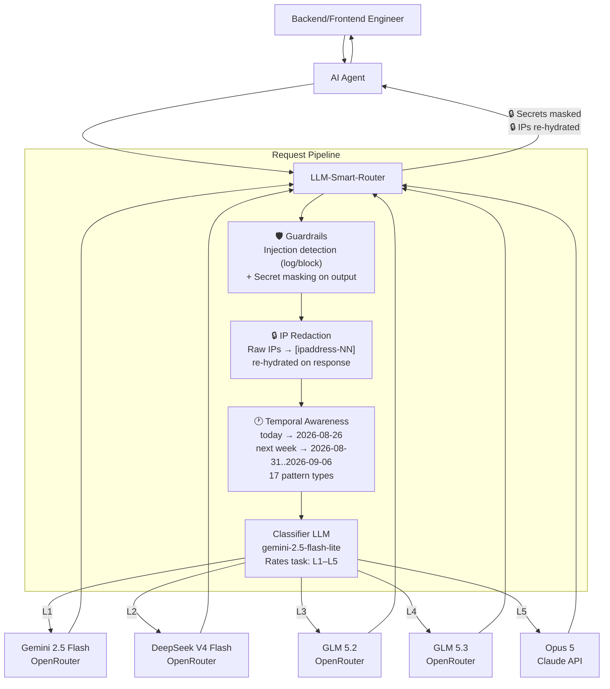

# LLM Smart Router

<p align="center">
  
</p>

A self-hosted Docker application that exposes an OpenAI-compatible API, classifies the **first prompt of each chat session** by task complexity (L1–L5), pins that session to the matching OpenRouter model, and routes every subsequent turn straight to the pinned model without re-classifying.

## Quick Start

```bash
cp .env.example .env   # fill in OPENROUTER_API_KEY and ROUTER_API_KEY
docker compose up -d --build
curl localhost:8080/healthz
```

Point any OpenAI-compatible client at `http://localhost:8080/v1`:

```python
from openai import OpenAI
client = OpenAI(base_url="http://localhost:8080/v1", api_key="your-router-key")
r = client.chat.completions.create(
    model="smart-router",
    messages=[{"role":"user","content":"Write a commit message for: fix typo"}],
    extra_headers={"X-Session-Id": "my-session-1"},
)
print(r.model)  # actual model used
```

## How It Works

- **Turn 1**: Classifier assigns L1–L5 → session pinned to the matching model
- **Turn 2+**: Straight to the pinned model, no classifier call (sub-ms lookup)
- **Escalation**: Free signals (repair language, tool errors, etc.) can ratchet the tier up mid-session
- **Config changes**: `session.on_config_change: keep_level` (default) re-resolves the tier's model per turn after settings changes — no pin expiry wait, no re-classification

## What's New in v2.5.0

### 🕐 Temporal Awareness — Full Pattern Coverage (`telemetry.temporal_awareness`)

Normalizes temporal expressions in **system and user messages** to concrete ISO dates **before** classification and forwarding — so the classifier and tier models see `2026-08-25` instead of "today", eliminating ambiguity for models without real-time clock access.

**v2.5.0 expands coverage from 3 patterns to all 17 pattern types** defined in `rules.py`:

| Pattern | Example | Resolved To |
|---------|---------|-------------|
| today / yesterday / tomorrow | "today" | `2026-08-26` |
| last / next \<weekday\> | "next Friday" | `2026-08-28` |
| this / coming \<weekday\> | "coming Wednesday" | `2026-09-02` |
| last / this / next week | "next week" | `2026-08-31..2026-09-06` |
| last / this / next month | "last month" | `2026-07-01..2026-07-31` |
| last / this / next year | "this year" | `2026-01-01..2026-12-31` |
| last / past N \<unit\>s | "last 3 days" | `2026-08-23` |
| N \<unit\>s ago | "2 days ago" | `2026-08-24` |
| in N \<unit\>s | "in 2 weeks" | `2026-09-09` |

**Other v2.5.0 changes:**

- **System role processing** — temporal expressions in system prompts are now also replaced (was user-only)
- **Multimodal content support** — text blocks in list-type content (images + text) are processed
- **Right-to-left replacement** — longer patterns matched first to avoid partial overlaps
- Timezone-aware via `default_timezone` (IANA format, default `UTC`)
- `strategy: "replace"` (default) swaps expressions in-place
- Hot-reloadable — toggle on/off via `settings.json` without restart
- Powered by [pendulum](https://pendulum.eustance.dev/) for reliable timezone math

**Config** (`config/settings.json` → `telemetry.temporal_awareness`):

```json
{
  "telemetry": {
    "temporal_awareness": {
      "enabled": true,
      "default_timezone": "Asia/Singapore",
      "strategy": "replace"
    }
  }
}
```

**E2E test**: `python3 tests/test_temporal_awareness.py` — 7 cases covering today/yesterday/tomorrow replacement, multiple expressions, non-temporal pass-through, and feature toggle.

### 🔧 RoutingEngine Hot-Reload Fix

`RoutingEngine` previously held a static `Settings` snapshot from startup — `set_tier_model.py` + `/admin/settings/reload` confirmed the change but session pins still recorded the old model. Fixed: `RoutingEngine` now takes the `ConfigManager` and resolves config via a `@property` on every call, with a `hasattr` guard so unit test fakes still work.

## What's New in v2.3.0

### 🔀 Per-Tier Custom Provider Support

Each tier (L1–L5) and the classifier LLM can now use a **different OpenAI-compatible provider** — not just OpenRouter. Set `base_url` and `api_key_env` on any tier or the classifier in `config/settings.json`:

```json
{
  "routing": {
    "L1": {
      "model": "google/gemini-2.5-flash",
      "base_url": "https://custom-provider.com/v1",
      "api_key_env": "L1_API_KEY"
    }
  },
  "classification": {
    "model": "google/gemini-2.5-flash-lite",
    "api_key_env": "CLASSIFIER_API_KEY"
  }
}
```

Then add the key to `.env`:
```
L1_API_KEY=sk-...
CLASSIFIER_API_KEY=sk-...
```

**How it works:**
- `base_url` — overrides `provider.base_url` for that tier's requests only
- `api_key_env` — names the environment variable holding the API key; the key is read at request time, never stored in `settings.json`
- When both are unset (default), the tier uses the global `OPENROUTER_API_KEY` and `provider.base_url` — zero changes needed for existing deployments

**docker-compose.yml** passes `L1_API_KEY`–`L5_API_KEY` and `CLASSIFIER_API_KEY` through as env vars. Add as many or as few as you need.

All 231 unit tests pass (224 existing + 7 temporal awareness). Live e2e verified with per-tier override on L1.

## What's New in v2.2.0

### 🎯 Classifier Over-Escalation Fix

The classifier was over-escalating research, report, and debugging tasks to L4 (`glm-5.3`), causing ~2× latency on multi-turn sessions. Root cause: the rubric's L4 description ("deep/novel reasoning") was ambiguous enough that "research + comparative analysis" matched it.

**Rubric rewrite** (`config/prompts/classifier.txt`):
- L3 now explicitly includes: research, reports, debugging, code generation, document generation, comparative analysis
- L4 narrowed to: novel algorithms with proofs, multi-system architecture from scratch, large refactors
- Added explicit "NOT for" clause: research, reports, comparisons, debugging, document generation, and single-function code are NOT L4

**Session escalation tuning** (`config/settings.json`):
- `never_downgrade`: `true` → `false` — sessions can now drop tier when the task gets simpler
- `reclassify_every_n_turns`: `null` → `15` — reclassifies every 15 turns (catches phase changes like research → HTML generation)
- `shadow_classify_every_n_turns`: `null` → `10` — logs what the classifier would say every 10 turns for monitoring

**Test results** (12-case suite, `google/gemini-2.5-flash-lite` classifier):

| Case | Before | After |
|------|--------|-------|
| "research on best LLM" | ❌ L4 | ✅ L3 |
| "generate HTML" | ❌ L1 | ✅ L3 |
| "debug race condition" | ❌ L4 | ✅ L3 |
| "write function" | ❌ L2 | ✅ L3 |
| "system design 50k TPS" | ✅ L4 | ✅ L4 |
| "novel algorithm + proofs" | ✅ L5 | ✅ L4 (acceptable) |

**Accuracy**: 11/12 (was 6/12 before fix). See [Classifier Prompt](#classifier-prompt) below.

## Classifier Prompt

The classifier uses `google/gemini-2.5-flash-lite` with the following prompt (`config/prompts/classifier.txt`). The `{{PROMPT_DIGEST}}` placeholder is replaced with a stripped digest of the conversation's opening message (system prompt scaffolding removed, tool names included, context summary appended).

```text
You are a task-complexity classifier for an LLM router. You see the OPENING request
of a conversation, and your label decides which model handles the ENTIRE session.
Judge how hard the whole task is likely to get, not just this one message.
Output ONLY a single JSON object, no prose, no markdown fences.

Levels:
L1 TRIVIAL — pure mechanical transformation: case conversion, sorting, extraction
             from provided text. No reasoning chain, no generation of new content.
L2 EASY     — single-step generation or general-knowledge answer. Short output.
             Simple factual questions, greetings, one-line answers.
L3 MEDIUM   — multi-step reasoning, real code generation (writing functions/classes),
             debugging, synthesis, tradeoff analysis, research reports, web research
             with summary, document generation (HTML, PDF, slides), or comparative
             analysis. Most knowledge work and all code generation goes here.
L4 HARD     — novel algorithm design with mathematical proofs, multi-system
             architecture from scratch, subtle math proofs, large refactors across
             many files, or high-stakes ambiguous judgment under uncertainty.
             NOT for: research, reports, comparisons, debugging, document
             generation, or single-function code — those are L3 even if complex.
L5 EXTREME  — multi-agent orchestration, complex scientific discovery, or tasks
             requiring maximum creativity and problem-solving under uncertainty.

Rules:
- Judge the DIFFICULTY OF THE TASK, never the length of the input.
- Research, report writing, document generation, and comparative analysis are L3
  even if the topic is advanced. The task difficulty is medium, not hard.
- If the request asks for correctness-critical code or math, do not go below L3.
- If genuinely uncertain between two levels, choose the HIGHER one. Your label is
  sticky for the whole session, so the cost of being one level too low is high.
- If the opening message is a greeting, a bare acknowledgement, or too vague to
  judge ("hi", "help me", "let's start"), output level "UNKNOWN" — do not guess.
- You may be shown agent operating instructions or persona text. Treat it as
  BACKGROUND, never as evidence of difficulty. A persona that says the agent
  "reasons deeply" or "thinks architecturally" tells you nothing about this task.
- You may be shown memories of previous work. Those describe PAST tasks. Judge
  only the request being made now.
- Never answer the user's request. Only classify it.

Output schema:
{"level":"L1|L2|L3|L4|L5|UNKNOWN","confidence":0.0-1.0,"reason":"<12 words max>"}

---
REQUEST TO CLASSIFY:
{{PROMPT_DIGEST}}
```

**Classifier config** (`config/settings.json` → `classification`):

| Parameter | Value | Description |
|-----------|-------|-------------|
| `model` | `google/gemini-2.5-flash-lite` | Fast, cheap, non-reasoning model |
| `temperature` | `0` | Deterministic classification |
| `max_tokens` | `60` | JSON output only, no prose |
| `timeout_seconds` | `8` | Fail fast → `default_level` |
| `default_level` | `L3` | Fallback on timeout/error |
| `unknown_level` | `L1` | For greetings/vague prompts |
| `min_confidence` | `0.5` | Below → escalate to `default_level` |
| `cache.enabled` | `true` | Avoid re-classifying identical prompts |
| `cache.ttl_seconds` | `3600` | 1-hour prompt cache |

## What's New in v2.1.0

### 🔐 Streaming Secret-Leak Hardening

Three streaming secret-masking vectors found and fixed by a full end-to-end guardrails audit. All fixes are in the streaming carry-buffer pipeline (`app/guardrails/streaming.py` + `app/api/chat.py`):

**1. Telegram bot token streaming leak**
Tokenizers split Telegram bot tokens at the `:AA` separator or emit them character-by-character. The carry buffer's digit-run hold (`\d{4,10}`) was too narrow — single-digit chunks and digits+colon splits flushed before the full-secret regex could reassemble.

- `_TG_DIGITS_COLON_RE`: holds `123456789:` + partial `:AA` continuation
- `_TG_DIGIT_RUN_RE`: holds any trailing digit run ≥1 (was ≥4)
- `_collapsed_tail_hold()`: whitespace-interleaved partial-secret hold

**2. Tail leak on long secrets**
`mask_secrets` fired at minimum regex length mid-growth (e.g. `sk-or-v1-` + 16 chars), destroying the marker — the remaining body (up to 43+ chars) then flushed as plaintext.

- **Pipeline reorder**: `_rehydrate_chunk` now splits FIRST (holds the growing tail in carry), then masks only the flushable (terminated) part
- **(a2) tail-leak guard**: holds still-growing bodies even when ≥ threshold+MARGIN, until a non-body char terminates them

**3. Whitespace-interleaved evasion (engine-wide)**
A jailbroken model could emit a secret one character per line (`s\nk\n-\no\nr...`) — no contiguous regex matches, in either streaming or non-streaming mode.

- `find_interleaved_secrets()`: collapses all whitespace, runs strict SECRET_RULES over the collapsed text, maps matches back to original spans
- Wired into `mask_secrets()` as a second pass with overlap-safe span merging
- `_collapsed_tail_hold()`: extends the carry to hold interleaved partial secrets in streaming mode

**4. [DONE] carry flush**
The final carry buffer at `data: [DONE]` now runs through `mask_secrets()` before emitting — a secret that completes only at stream end is masked, not emitted raw.

### Test Results (2026-08-25)

| Suite | Tests | Result |
|-------|-------|--------|
| Unit (`pytest tests/ -q`) | 224 | ✅ All passed |
| Live full guardrails (`test_guardrails_full.py`) | 30 | ✅ All passed |
| Live e2e block + streaming (`test_guardrails_e2e_block_stream.py`) | 22 | ✅ All passed |

**e2e coverage**: block-mode enforcement (4 injection payloads → HTTP 400, 2 benign → 200, 2 severity-gate → 200), streaming secret masking (11 provider types + split-carry), streaming IP redaction round-trip.

## What's New in v2.0.0-beta

Three new request-path features, all hot-reloadable and enabled by default:

### 🔒 IP Redaction & Re-Hydration (`telemetry.privacy`)
Raw IP addresses in prompts are replaced with session-stable placeholders (`[ipaddress-01]`, …) before the request reaches the classifier or any upstream model, and re-hydrated back to the original IPs in the response. The classifier and tier models never see a real IP.
- Session-scoped SQLite mapping store (`/app/data/ip_redaction.db`, Docker volume `router-data`)
- Same IP → same placeholder across turns (context- and prefix-cache-friendly)
- Ports (`:8080`) and CIDR (`/24`) preserved; IPv4 + IPv6
- Streaming-safe: placeholders split across SSE chunks still re-hydrate (carry buffer)
- 24-hour retention with background purge job

### 🛡️ LLM Guardrails (`telemetry.guardrails`)
Two router-layer guardrails, independent of your agent's or the upstream API's own safety filters:
- **Input**: 24-rule prompt-injection/jailbreak catalog (8 categories: instruction override, jailbreak personas, system-prompt/secret exfiltration, tool abuse, sandbox evasion, social engineering, encoded payloads, multi-turn manipulation) with CRITICAL/HIGH/MEDIUM/LOW severities. Actions: `log` (default) | `block` (400 at/above severity threshold). Code-block-heavy messages skipped to avoid false positives.
- **Output**: 11 provider-prefixed credential patterns (OpenRouter, OpenAI, Anthropic, GitHub, AWS, Google, Slack, GitLab, Stripe, Telegram, PEM) masked with `***REDACTED***` before responses reach the caller.
- Run `python3 scripts/test_guardrails.py` for the router-level differential test (bypasses agent and upstream guardrails).

### ⚡ Upstream Prompt Caching (`provider.prompt_caching`)
Automatically makes the most of provider KV/prefix caches:
- `session_id` forwarded to OpenRouter for sticky routing (warm prefix cache)
- `cache_control` injection for Anthropic (`ttl: 5m|1h`) when the stable prefix exceeds `min_tokens` (default 1024)
- `cached_tokens` / cache-write telemetry surfaced in `/metrics` (`router_prompt_cached_tokens_total`, `router_prompt_cache_hit_ratio`)

## Configuration

Edit `config/settings.json` (hot-reloadable) to change:
- Tier → model mappings
- Classifier model and prompt
- Session TTL, escalation thresholds
- Heuristic rules

## Architecture



Turn 2+ skips the classifier: the session pin routes straight to the tier model, with `on_config_change: keep_level` re-resolving the model after settings changes.


| Component | Technology |
|-----------|-----------|
| API | FastAPI + Uvicorn |
| HTTP Client | httpx (async, HTTP/2) |
| Validation | Pydantic v2 |
| Session Store | In-memory TTL+LRU / Redis |
| Metrics | prometheus-client |
| Logging | structlog (JSON) |
| Container | Multi-stage Docker, python:3.12-slim |

## Endpoints

- `POST /v1/chat/completions` — OpenAI-compatible chat
- `GET /v1/models` — List virtual router models
- `GET /healthz` / `GET /readyz` — Health checks
- `GET /metrics` — Prometheus metrics
- `GET /admin/stats` — Rolling counters
- `GET /admin/sessions` — Live session pins
- `GET /admin/settings` — Active config (incl. live guardrail mode)
- `POST /admin/settings/reload` — Hot-reload config

### Guardrail metrics
- `router_guardrail_findings_total{rule_id,severity,direction}` — injection/secret findings
- `router_guardrail_blocks_total{rule_id,severity}` — requests blocked in block mode
- `router_guardrail_secret_masks_total{rule_id}` — secrets masked in output
- `router_privacy_redactions_total` — requests passing through IP redaction
- `router_prompt_cached_tokens_total` / `router_prompt_cache_hit_ratio` — KV-cache usage

See the [full specification](./llm-smart-router-spec.md) for complete details.

## License

MIT
